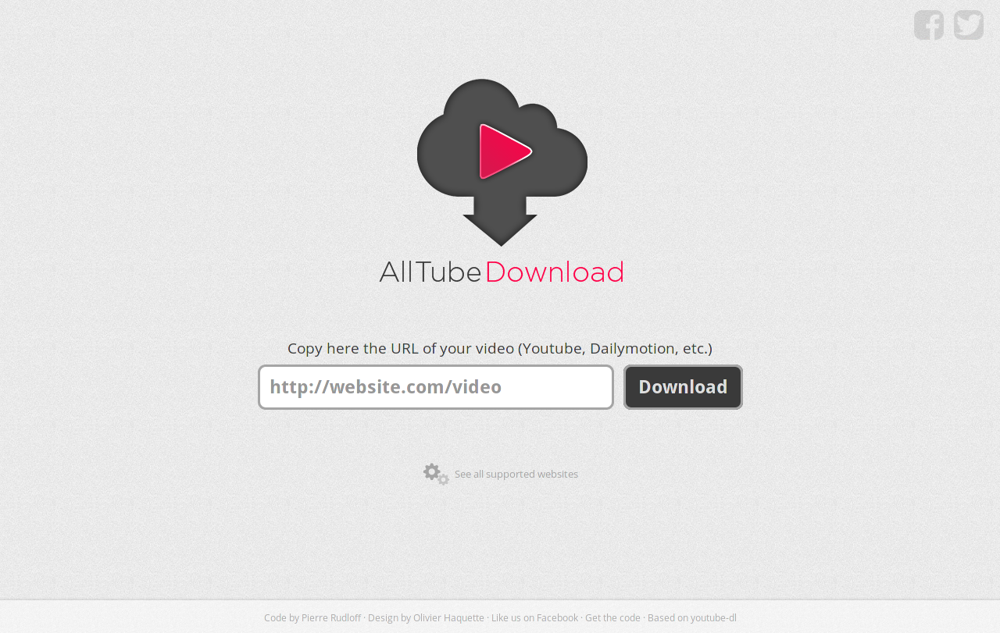

<!--
N.B.: This README was automatically generated by https://github.com/YunoHost/apps/tree/master/tools/README-generator
It shall NOT be edited by hand.
-->

# AllTube for YunoHost

[](https://dash.yunohost.org/appci/app/alltube)    
[](https://install-app.yunohost.org/?app=alltube)

*[Lire ce readme en français.](./README_fr.md)*

> *This package allows you to install AllTube quickly and simply on a YunoHost server.
If you don't have YunoHost, please consult [the guide](https://yunohost.org/#/install) to learn how to install it.*

## Overview

Web interface for Youtube-dl

**Shipped version:** 3.0.0~ynh1

**Demo:** https://alltubedownload.net/

## Screenshots



## Disclaimers / important information

## Configuration

To configure AllTube: edit the file `/var/www/alltube/config/config.yml` via SSH.

## Documentation and resources

* Official app website: https://alltubedownload.net/
* Official admin documentation: https://github.com/Rudloff/alltube/blob/master/resources/FAQ.md
* Upstream app code repository: https://github.com/Rudloff/alltube
* YunoHost documentation for this app: https://yunohost.org/app_alltube
* Report a bug: https://github.com/YunoHost-Apps/alltube_ynh/issues

## Developer info

Please send your pull request to the [testing branch](https://github.com/YunoHost-Apps/alltube_ynh/tree/testing).

To try the testing branch, please proceed like that.
```
sudo yunohost app install https://github.com/YunoHost-Apps/alltube_ynh/tree/testing --debug
or
sudo yunohost app upgrade alltube -u https://github.com/YunoHost-Apps/alltube_ynh/tree/testing --debug
```

**More info regarding app packaging:** https://yunohost.org/packaging_apps