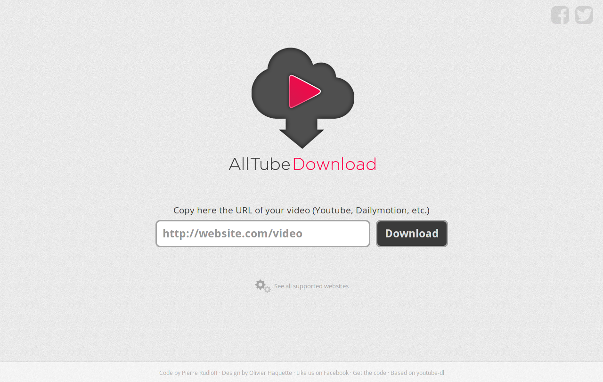

<!--
N.B.: This README was automatically generated by https://github.com/YunoHost/apps/tree/master/tools/README-generator
It shall NOT be edited by hand.
-->

# AllTube pour YunoHost

[](https://dash.yunohost.org/appci/app/alltube)  

[](https://install-app.yunohost.org/?app=alltube)

*[Read this readme in english.](./README.md)*

> *Ce package vous permet d’installer AllTube rapidement et simplement sur un serveur YunoHost.
Si vous n’avez pas YunoHost, regardez [ici](https://yunohost.org/#/install) pour savoir comment l’installer et en profiter.*

## Vue d’ensemble

Interface Web pour Youtube-dl

**Version incluse :** 3.1.0~ynh1

**Démo :** https://alltubedownload.net/

## Captures d’écran



## Avertissements / informations importantes

## Configuration

Pour configurer AllTube : éditez le fichier `/var/www/alltube/config/config.yml` via SSH.

## :red_circle: Fonctions indésirables

- **Non-free Network Services**: Promotes or depends entirely on a non-free network service.

## Documentations et ressources

* Site officiel de l’app : <https://alltubedownload.net/>
* Documentation officielle de l’admin : <https://github.com/Rudloff/alltube/blob/master/resources/FAQ.md>
* Dépôt de code officiel de l’app : <https://github.com/Rudloff/alltube>
* Documentation YunoHost pour cette app : <https://yunohost.org/app_alltube>
* Signaler un bug : <https://github.com/YunoHost-Apps/alltube_ynh/issues>

## Informations pour les développeurs

Merci de faire vos pull request sur la [branche testing](https://github.com/YunoHost-Apps/alltube_ynh/tree/testing).

Pour essayer la branche testing, procédez comme suit.

``` bash
sudo yunohost app install https://github.com/YunoHost-Apps/alltube_ynh/tree/testing --debug
ou
sudo yunohost app upgrade alltube -u https://github.com/YunoHost-Apps/alltube_ynh/tree/testing --debug
```

**Plus d’infos sur le packaging d’applications :** <https://yunohost.org/packaging_apps>